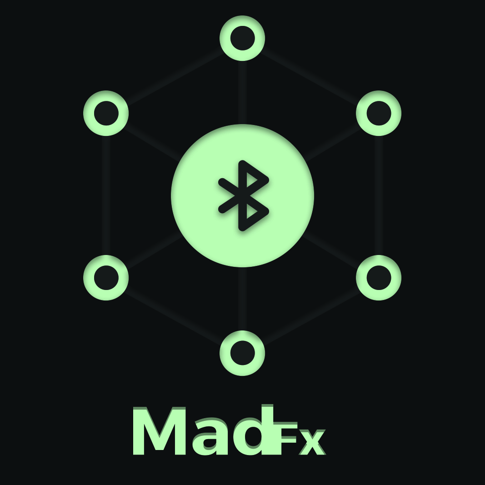
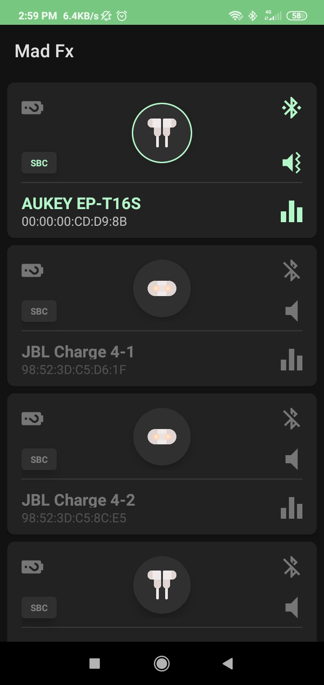
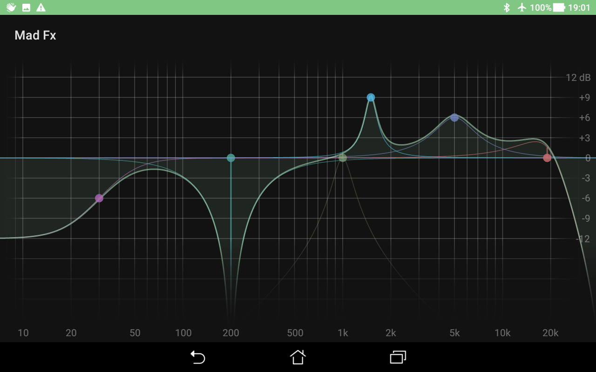
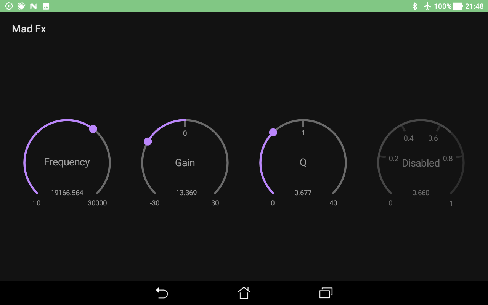

	

# MadFx
An Android application to handle your Bluetooth devices audio configuration (volumes, equalization and some effects)

## Todo list

 - [ ] Documentations
 - [ ] Unit tests
 - [ ] Device list view
     - [x] Retrieve paired devices
        - [ ] Background service when a new device is paired while the app is running ?
     - [x] Retrieve device connection and playing state
     - [x] Retrieve audio device type
        - [ ] Change icons
        - [ ] Find a solution to differentiate earbuds and headphones
     - [ ] Find a solution to retrieve connected devices battery level (when BLE Gatt service is not available)
     - [ ] Find a solution to retrieve devices audio codecs (bypass hidden API ? Not a classy solution but maybe the only one)
        - [ ] List of available audio codecs
        - [ ] Retrieve current set audio codec
	 - [ ] Sort devices based on connection and playing state without refill the entire RecyclerView dataset
	 - [ ] Able to (dis)connect a device
	 - [ ] Able to (un)mute a device
 - [ ] Notification view
 - [ ] Equalizer view
	 - [ ] Parametric view
	 - [ ] Simple curve view (linear scale)
	 - [ ] Curve view (log10 scale)
	    - [ ] Control Panel (Band type, frequency, gain, Q)
	 - [ ] Find a solution to handle 10+ bands frequencies independent of the device
	    - [x] BiQuadraticFilter (perfect for drawing curve, need to test with subclass AudioEffect class)
 - [ ] Volumes view
	 - [ ] Media
	 - [ ] Ring/notification/system
	 - [ ] Alarm
 - [ ] Effects view
	 - [ ] Virtualization
	 - [ ] Loudness
	 - [ ] Bass boost
 - [x] Knob component
    - [x] Drawing
    - [x] Touch events (scroll, single tap, double tab)
       - [x] Horizontal
       - [x] Vertical
       - [x] Circular
    - [x] Value formatter
    - [x] Label formatter
    - [x] Middle point scale (use case, Q scale 0.025 -> 1.0 -> 40 where 1.0 is middle point)
    - [x] Bipolar orientation
 - [ ] Presets (Normal, Rock, Jazz, ...)
 - [ ] Profiles management
	 - [ ] Store profile locally
	 - [ ] Store profile on the cloud (sync with stored local profiles)
	 - [ ] Keep track when Bluetooth device is unpaired (mean still stored in case of the device will be paired again)
	 - [ ] Link profile across Bluetooth devices (use case, JBL Connect+)
	 - [ ] Background service to handle device (de)connection and activate the proper profile (volumes, effects, ...)